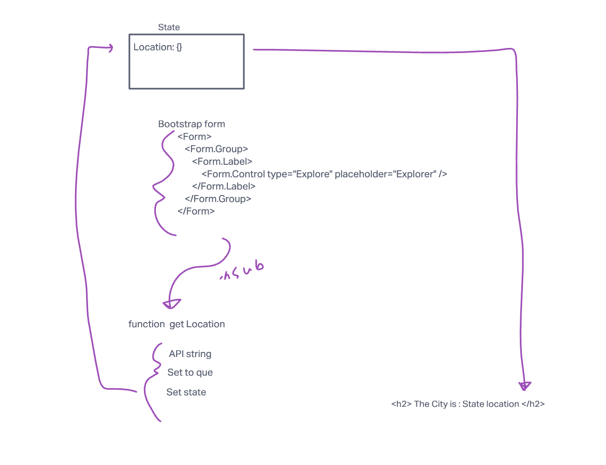
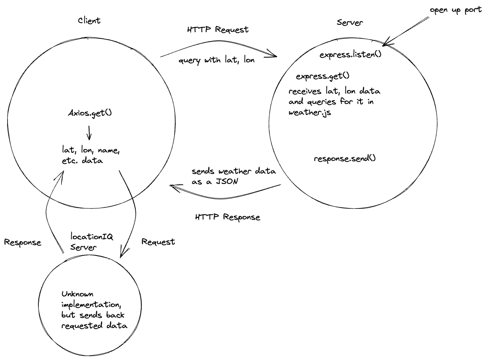
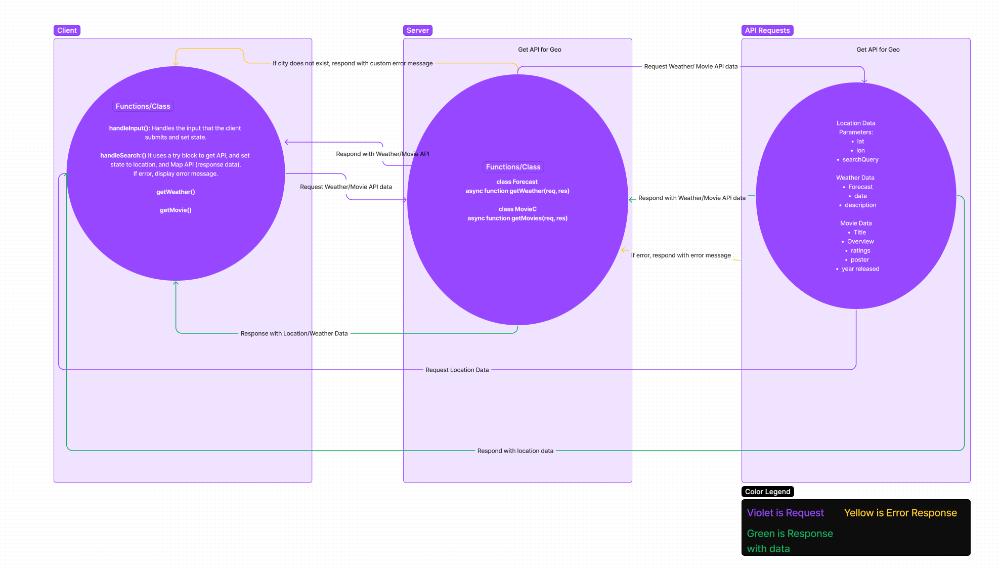
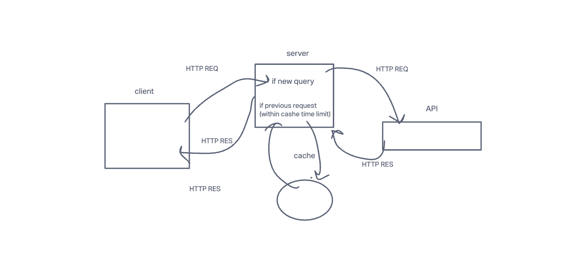

# City-Explorer

**Author**: Matthew Gebhart
**Version**: 1.0.4

## Overview
provide easy searching of a USA city to give geographical information. 

## Getting Started
using the Location IQ Geocoding API and Axios to perform search queries. 

## Architecture
<!-- Provide a detailed description of the application design. What technologies (languages, libraries, etc) you're using, and any other relevant design information. -->

## Change Log
- 9-26-2022 implementation and proof of life. Got all data reading from API and rendering to page. No styling done yet
- 9-27-2022 implemented server and proof of life
- 9-28-2022 got express server working and submitting weather.json data back to client
- 9-29-2022 Added modules/components, having trouble with query requests for Movie DB
- 9-30-2022 Resolved Query issues, everything talking and working. Some styling for movie cards, componentized and modularized(?) more things. 

## Credit and Collaborations
- credit to Sage Jankowski for some ideation and paired programming on Lab 6
- credit to Julian Gallegos for image mapping and collaboration on Lab 7 and also for lots of help with the server functions. 
- credit to Maximo VincenteMeija for WRRC mapping for lab 8
- credit to Jose Gonzalez for collab on WRRC drawing for lab 10 

Lab 6 web request response cycle drawing with Sage Jankowski

Lab 7 web response cycle for lab 7 tasks (collaboration with Julian)

Lab 8 web response cycle with Maximo Vincente

Lab 10 WRRC image with Jose Gonzalez

### Project tracking Trello: 
https://trello.com/b/aTSeqvNr/city-explorer

### Netlify Deploy:
https://city-explorer-318.netlify.app/

### Heroku (back-end) Deploy:
https://city-explorer-matthewgebhart.herokuapp.com/

## Time Estimates

**Name of feature:** Lab 6 implement API and form

Estimate of time needed to complete: 3

Start time: _____

Finish time: _____

Actual time needed to complete: ___6__

**Name of feature:** Lab 7 - implement express server for weather data and deploy to Netlify

Estimate of time needed to complete: __4___

Start time: _____

Finish time: _____

Actual time needed to complete: _____

**Name of feature:** Lab 8 - add Movies API and publish backend to Heroku

Estimate of time needed to complete: __5___

Start time: _____

Finish time: _____

Actual time needed to complete: __11+___

**Name of feature:** Lab 9 - refactor and componentize front and back ends

Estimate of time needed to complete: __3___

Start time: _____

Finish time: _____

Actual time needed to complete: __3___

**Name of feature:** Lab 10 - adding Cashe to improve performance

Estimate of time needed to complete: __3___

Start time: _____

Finish time: _____

Actual time needed to complete: _____

# Getting Started with Create React App

This project was bootstrapped with [Create React App](https://github.com/facebook/create-react-app).

## Available Scripts

In the project directory, you can run:

### `npm start`

Runs the app in the development mode.\
Open [http://localhost:3000](http://localhost:3000) to view it in your browser.

The page will reload when you make changes.\
You may also see any lint errors in the console.

### `npm test`

Launches the test runner in the interactive watch mode.\
See the section about [running tests](https://facebook.github.io/create-react-app/docs/running-tests) for more information.

### `npm run build`

Builds the app for production to the `build` folder.\
It correctly bundles React in production mode and optimizes the build for the best performance.

The build is minified and the filenames include the hashes.\
Your app is ready to be deployed!

See the section about [deployment](https://facebook.github.io/create-react-app/docs/deployment) for more information.

### `npm run eject`

**Note: this is a one-way operation. Once you `eject`, you can't go back!**

If you aren't satisfied with the build tool and configuration choices, you can `eject` at any time. This command will remove the single build dependency from your project.

Instead, it will copy all the configuration files and the transitive dependencies (webpack, Babel, ESLint, etc) right into your project so you have full control over them. All of the commands except `eject` will still work, but they will point to the copied scripts so you can tweak them. At this point you're on your own.

You don't have to ever use `eject`. The curated feature set is suitable for small and middle deployments, and you shouldn't feel obligated to use this feature. However we understand that this tool wouldn't be useful if you couldn't customize it when you are ready for it.

## Learn More

You can learn more in the [Create React App documentation](https://facebook.github.io/create-react-app/docs/getting-started).

To learn React, check out the [React documentation](https://reactjs.org/).

### Code Splitting

This section has moved here: [https://facebook.github.io/create-react-app/docs/code-splitting](https://facebook.github.io/create-react-app/docs/code-splitting)

### Analyzing the Bundle Size

This section has moved here: [https://facebook.github.io/create-react-app/docs/analyzing-the-bundle-size](https://facebook.github.io/create-react-app/docs/analyzing-the-bundle-size)

### Making a Progressive Web App

This section has moved here: [https://facebook.github.io/create-react-app/docs/making-a-progressive-web-app](https://facebook.github.io/create-react-app/docs/making-a-progressive-web-app)

### Advanced Configuration

This section has moved here: [https://facebook.github.io/create-react-app/docs/advanced-configuration](https://facebook.github.io/create-react-app/docs/advanced-configuration)

### Deployment

This section has moved here: [https://facebook.github.io/create-react-app/docs/deployment](https://facebook.github.io/create-react-app/docs/deployment)

### `npm run build` fails to minify

This section has moved here: [https://facebook.github.io/create-react-app/docs/troubleshooting#npm-run-build-fails-to-minify](https://facebook.github.io/create-react-app/docs/troubleshooting#npm-run-build-fails-to-minify)

